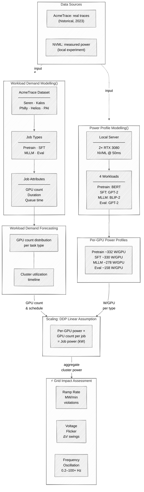
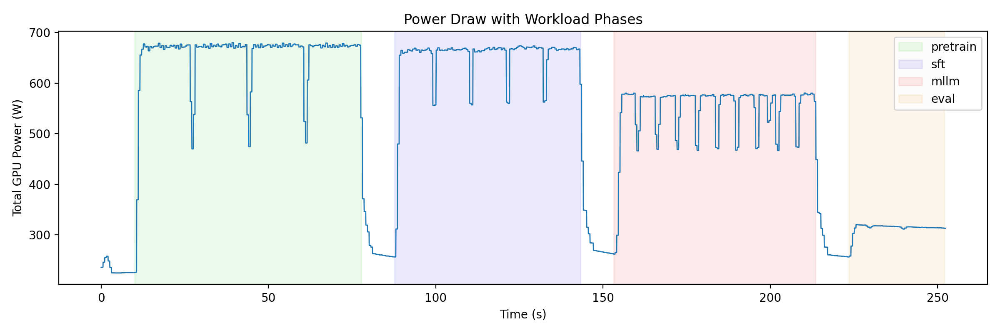

# Understanding GPU Power Profiles in AI Data Centers

## Motivation

As AI training clusters grow to hundreds of megawatts, understanding their power consumption behavior has become critical for grid planning and data center operations. Choukse et al. (2025) — *Power Stabilization for AI Training Datacenters* (arXiv: 2508.14318, Microsoft / OpenAI / NVIDIA) — present the first detailed characterization of power dynamics in large-scale AI training facilities. Their key findings motivate this project:

**GPU power is not constant during training.** Each training iteration cycles through compute-heavy phases (forward/backward pass, drawing near-TDP power) and communication phases (gradient synchronization, where GPU power drops significantly). Because bulk-synchronous parallelism keeps thousands of GPUs in lock-step, these cycles are **correlated across the entire cluster**, producing large aggregate power swings rather than averaging out.

**These swings create real problems for the electrical grid:**

1. **Ramp rate violations.** Rapid power transitions between training phases can exceed the MW/minute ramp limits that utilities impose on large loads. Choukse et al. show that AI data centers can violate ramp rate thresholds much more frequently than conventional workloads.
2. **Dynamic power range and voltage flicker.** The difference between peak and trough power during a training job determines the dynamic power envelope the grid must accommodate. Large swings can cause voltage fluctuations on distribution feeders, known as flicker.
3. **Frequency-domain concerns.** The periodic nature of training iterations injects power oscillations at specific frequencies. Inter-area oscillation modes (roughly 0.2–3 Hz) are a known grid stability concern, and per-iteration cycling of large GPU clusters can fall in or near these bands. Torsional resonance of turbine-generator shafts occurs at higher frequencies (roughly 7–100+ Hz) and is a separate concern; the point is that periodic load patterns at any frequency deserve grid-impact analysis.

**Note on time scales:** The per-iteration power oscillations documented in Choukse et al. (their Figure 1 and StratoSim simulations) occur at sub-second granularity within individual training steps. Our simulation experiment does *not* capture these intra-iteration dynamics — we profile at the workload-phase level, measuring the average power envelope of each task type (Pretrain, SFT, MLLM, Eval) over tens of seconds to minutes. This gives us the **static power profile per workload type**, which is the building block for estimating aggregate data center demand when combined with job scheduling traces. Capturing the fast intra-step oscillations would require sub-millisecond instrumentation and is left for future work.

This project takes a first step toward characterizing workload-level power profiles: we analyze real data center job traces to understand workload composition, then measure per-GPU power draw for representative AI tasks on local hardware.

### Project Flow



---

## Part 1: Data Center Workload Composition

### Data Source

We use the **AcmeTrace** dataset (published on HuggingFace: `Qinghao/AcmeTrace`), which contains job-level traces from five production GPU clusters: **Seren, Kalos, Philly, Helios, and PAI**.

After inspecting all five subsets, we found that only **Seren** and **Kalos** include job-type labels. Among them, Seren provides full coverage of the four target types (Pretrain, SFT, MLLM, Eval), while Kalos lacks MLLM jobs (and has only 6 SFT records). The other three clusters (Philly, Helios, PAI) do not record job types at all. Therefore, our analysis primarily relies on the **Seren** trace.

### Data Cleaning

From the raw Seren trace (~1 million jobs), we filtered out non-GPU job categories (`Other`, `Debug`, `CPU`), kept only successfully completed jobs (`state == COMPLETED`), and removed zero-duration entries. This yields **179,199 valid GPU jobs** across four types:

| Task Type | Job Count | Proportion |
|-----------|-----------|------------|
| Eval      | 134,269   | 74.9%      |
| SFT       | 39,326    | 21.9%      |
| MLLM      | 4,656     | 2.6%       |
| Pretrain  | 948       | 0.5%       |

### Key Findings: GPU Usage by Task Type

The following table summarizes the GPU allocation per job across types:

| Stat       | Eval | MLLM | Pretrain | SFT |
|------------|------|------|----------|-----|
| Mean GPUs  | 2.3  | 5.7  | **220.8**| 6.1 |
| Median GPUs| 1    | 2    | **128**  | 8   |
| 5th pctl   | 1    | 1    | 48       | 1   |
| 95th pctl  | 8    | 8    | **768**  | 8   |
| Max GPUs   | 128  | 256  | **1,024**| 512 |

**Pretrain jobs use far more GPUs** than any other type (median 128, up to 1,024), while Eval and SFT typically use 1–8 GPUs. This aligns with the industry pattern where large-scale pretraining requires massive data-parallel or model-parallel GPU clusters.

### Job Duration by Task Type
 
| Stat         | Eval     | SFT      | MLLM      | Pretrain   |
|--------------|----------|----------|-----------|------------|
| Mean         | 0.35 h   | 0.27 h   | **1.71 h**| **1.51 h** |
| Median       | 0.09 h   | 0.09 h   | 0.18 h    | 0.02 h     |
| 5th pctl     | 0.03 h   | 0.02 h   | 0.01 h    | ~0 h       |
| 95th pctl    | 1.02 h   | 0.76 h   | **6.98 h**| **8.68 h** |
| Max          | 324.11 h | 117.54 h | 91.00 h   | 146.64 h   |

MLLM and Pretrain jobs run much longer on average (hours to days) compared to Eval/SFT (minutes to hours). At the 95th percentile, Pretrain jobs reach ~8.7 hours and MLLM ~7.0 hours.

### Queue Time by Task Type

| Stat         | Eval     | SFT      | MLLM       | Pretrain  |
|--------------|----------|----------|------------|-----------|
| Mean         | 0.07 h   | 0.05 h   | **0.20 h** | 0.02 h    |
| Median       | ~0 h     | ~0 h     | ~0 h       | ~0 h      |
| 95th pctl    | 0.26 h   | 0.15 h   | **0.62 h** | 0.01 h    |
| Max          | 19.03 h  | 15.91 h  | 15.45 h    | 4.35 h    |

MLLM jobs wait longest (mean 0.20 h); Pretrain jobs (despite high GPU count) have remarkably short queue times (mean 0.02 h), suggesting they receive priority scheduling.

### Overall Cluster Utilization

Across the Seren trace (~173-day span, 2023-03-02 to 2023-08-21):

| Stat              | Concurrent GPUs |
|-------------------|-----------------|
| Mean              | **259**         |
| Median            | 178             |
| 25th pctl         | 11              |
| 75th pctl         | 332             |
| 95th pctl         | 993             |
| Peak (max)        | **1,705**       |
| Idle time (0 GPUs)| 21.7%           |

The cluster runs an average of **~259 GPUs concurrently** (median 178), peaking at **1,705 GPUs** simultaneously. Roughly 21.7% of minutes have zero active GPUs, indicating significant idle periods.

---

## Part 2: GPU Power Profiling via Simulation

### Setup

We used our own server equipped with **2 × NVIDIA GeForce RTX 3080 GPUs** to simulate the four workload types. Power consumption was sampled at 50 ms intervals via NVML (`pynvml`), and the experiment was orchestrated using PyTorch's `torchrun` with Distributed Data Parallel (DDP) across both GPUs.

### Workloads Simulated

Each workload uses a representative model architecture:

| Phase    | Model                              | Description                           |
|----------|-------------------------------------|---------------------------------------|
| Pretrain | bert-base-uncased (Transformer encoder) | Full forward + backward pass training |
| SFT      | GPT-2 (CausalLM)                   | Supervised fine-tuning with gradients  |
| MLLM     | BLIP-2 (Salesforce/blip2-opt-2.7b) | Vision-to-text multimodal training     |
| Eval     | GPT-2 (Autoregressive decoding)    | Inference-only, no gradient computation|

The phases ran sequentially with idle gaps between them (10 s each) for clear phase separation.

### Results



| Phase    | Mean Power (W) | Std (W) | Min (W) | Max (W) |
|----------|---------------|---------|---------|---------|
| Pretrain | **663.5**     | 38.9    | 470.1   | 680.4   |
| SFT      | **658.9**     | 28.8    | 556.0   | 674.2   |
| MLLM     | **556.1**     | 37.3    | 466.3   | 580.4   |
| Eval     | **315.7**     | 1.7     | 311.4   | 319.4   |

*Total power across 2 GPUs; per-GPU values are approximately half.*

### Observations

- **Pretrain ≈ SFT >> MLLM >> Eval** in mean power draw. Training workloads (forward + backward + optimizer) are substantially more power-hungry than inference.
- **Eval power is remarkably stable** (std ≈ 1.7 W), reflecting the steady-state nature of autoregressive decoding without gradient computation.
- **Pretrain and MLLM show higher variance** (std ≈ 37–39 W), likely due to intermittent communication overhead and memory-intensive operations.
- SFT is slightly below Pretrain because our toy SFT model (GPT-2) is smaller in parameter count and feedforward width than the Pretrain model; in practice, pretraining usually draws more power than SFT on the same model due to longer sequences and larger batch sizes.

### Why Single-Server Profiling Scales to Data Center Estimation

In data center training, a model is trained using **data parallelism** (e.g., DDP) across many GPUs. In this paradigm, each GPU independently processes a shard of the data and performs the same computation — forward pass, backward pass, and gradient synchronization. Because every GPU executes the **same workload in lock-step**, the per-GPU power profile remains consistent regardless of cluster size. The small communication overhead for gradient all-reduce adds minimal power draw beyond the compute portion.

Therefore, the per-GPU power profile measured on our 2-GPU server can be **linearly scaled** by the number of GPUs to estimate total cluster power for a given job. For example:
- A Pretrain job using 128 GPUs would draw approximately $128 \times 332 \approx 42.5\text{ kW}$ (using ~332 W per GPU).
- An Eval job using 8 GPUs would draw approximately $8 \times 158 \approx 1.3\text{ kW}$.

Combined with Part 1's workload composition data (GPU count distribution and job type proportions), this enables estimation of aggregate power demand across a data center.

---

## Summary

| Aspect | Key Takeaway |
|--------|-------------|
| Job mix | Eval jobs dominate by count (~75%), but Pretrain dominates GPU-hours due to massive GPU allocation (median 128 GPUs) |
| GPU range | Pretrain: 48–768 GPUs (5th–95th pctl); SFT/MLLM/Eval: typically 1–8 GPUs |
| Power per GPU | Pretrain/SFT: ~330 W; MLLM: ~278 W; Eval: ~158 W |
| Scalability | Per-GPU profiles scale linearly due to synchronous data-parallel training |
| Cluster utilization | Average ~259 GPUs active concurrently, peak ~1,705 GPUs |

---

## References

- Choukse, E. et al. (2025). *Power Stabilization for AI Training Datacenters.* arXiv:2508.14318. Microsoft / OpenAI / NVIDIA.
- AcmeTrace dataset: `Qinghao/AcmeTrace` on HuggingFace.

---

## Repository Structure

```
Power draw/
├── README.md                  # This document
├── requirements.txt           # Python dependencies
├── .gitignore
├── Choukse2025_Power_Stabilization_AI_Datacenters.pdf  # Reference paper (arXiv:2508.14318)
├── data/                      # AcmeTrace job traces (download from HuggingFace)
│   ├── cluster_summary.csv
│   ├── trace_seren.csv        # Primary dataset used in analysis
│   ├── trace_kalos.csv
│   ├── helios_trace.csv
│   ├── philly_trace.csv
│   ├── philly_trace_merge_retry.csv
│   └── pai_trace.csv
├── code/                      # Experiment scripts
│   ├── run.py                 # Main power profiling experiment (torchrun)
│   ├── LLM_toymodel.py        # Workload definitions (Pretrain/SFT/MLLM/Eval)
│   └── utils.py               # DDP & NVML utilities
├── notebooks/                 # Analysis notebooks
│   ├── CheckDataset.ipynb     # Part 1: Data center trace analysis
│   └── result.ipynb           # Part 2: Power profiling results & visualization
├── results/                   # Experiment outputs (generated by run.py)
│   ├── timestamps.npy
│   ├── power_per_gpu.npy
│   ├── power_total.npy
│   ├── phase_times.npy
│   ├── phase_labels.npy
│   └── power_draw.png
├── outputs/                   # Rendered HTML/PDF reports
│   ├── CheckDataset.html
│   ├── result.html
│   └── README.pdf             # PDF export of this README
└── reference/                 # Tutorial notebooks (external, for learning only)
    ├── Pretrain.ipynb
    ├── SFT.ipynb
    ├── MLLM.ipynb
    └── Eval.html
```

### How to Reproduce

1. Download AcmeTrace data: `huggingface-cli download Qinghao/AcmeTrace --local-dir data/`
2. Install dependencies: `pip install -r requirements.txt`
3. Run power profiling (requires NVIDIA GPU): `torchrun --standalone --nproc_per_node=2 code/run.py`
4. Open `notebooks/result.ipynb` to visualize results
5. Open `notebooks/CheckDataset.ipynb` to explore the trace data
